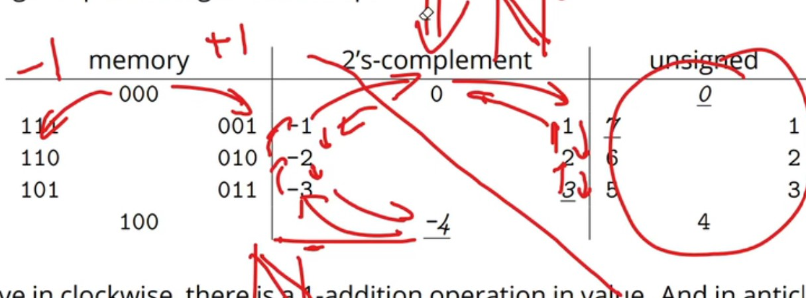
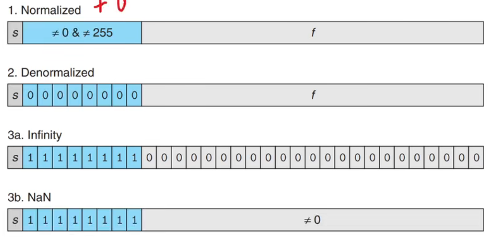
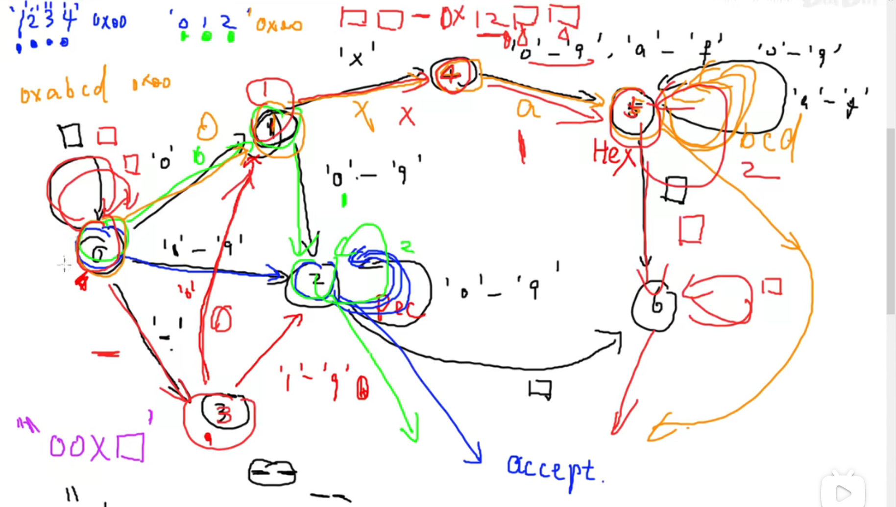
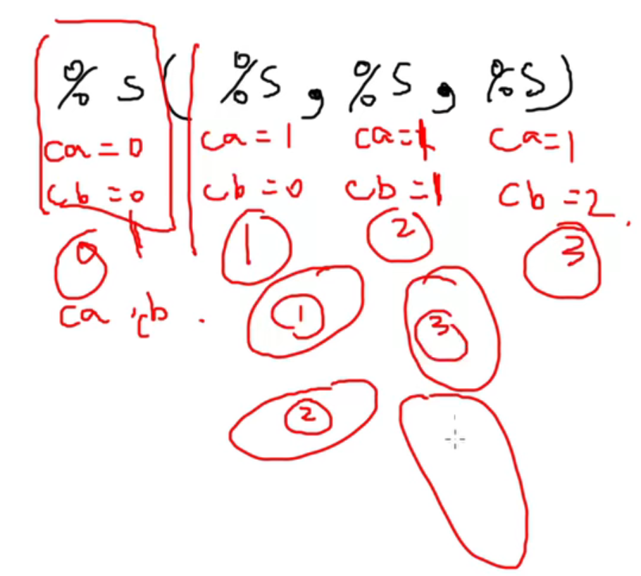
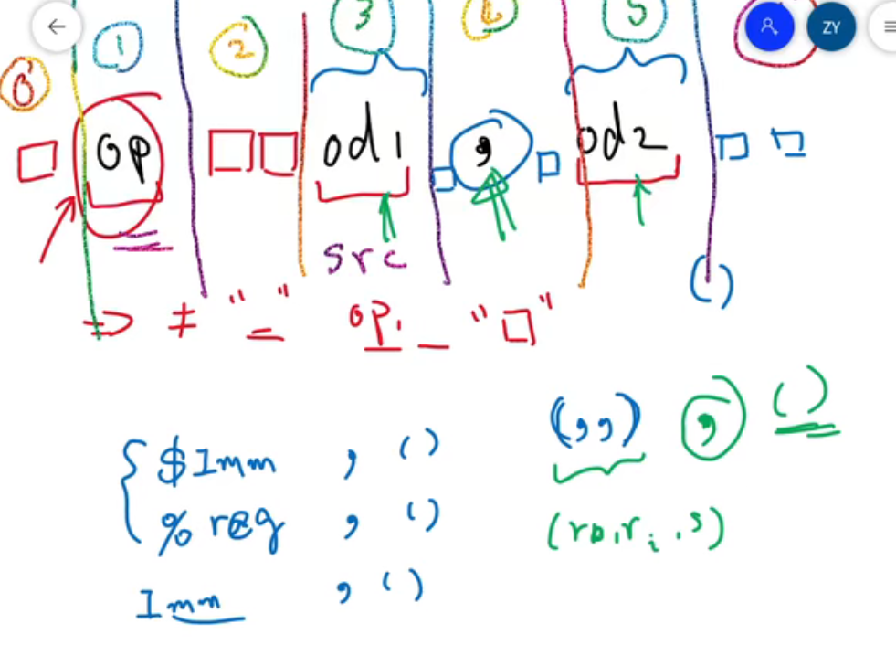

## 1.信息的表示和处理

### 00 无符号整数，二进制补码
- 1. 内存分块
  - $n/m \leq\ 2^m$
  - 共nbit内存，mbit一个块，需要满足上述关系才能找到块，就是m位寻址呗
  - 

- 2. 二进制与十进制 都是对同一个数的同构
  - 运算也是一一对应的  回想起近世代数知识
  - 符号序列的加一减一为循环运算，00-1 = 11   00 01 10 11 循环
  - 
  - 好吧还是没有显示 图片说明“补码的由来 妙啊”
  - 0  -4的并没有对称的啊 取反加一还是自己
  - 


### 01 位运算 树状数组 
- 1. **位运算找出二进制里最低位的1**  
  1010 & (~1010+1)(0110) = 0010 
  ```c
  unsigned LowBit(unsigned x){
    return x&(~x+1)
  }
  ```

  以此引出一个数据结构**树状数组**
  
  线段树？？$T_i$ 
  $S_i$为前n项和
  T数组和S数组的关系 向左最高的节点
  
  ```c
  int main(){
    unsigned n = 7;
    printf("S[u%] = \n", n)
    
    while(n>0){
      n = n - LowBit(n)
      prinft("T[u%]\n+", n)
    }
    printf("T[u%]\n", n)
  }
  ```
### 02 浮点数表示，类型转换  
$(-1)^s*1.f*2^E$ 
the standard is set by IEEE
- 对于32位小数m来说  
 - `s : m[31]`  
 - `e : m[30-23]` 8位  `E = e-bias`  
 - `f : m[22-0]` 23位 fraction
   - 比如e = -5，指数部分需减去一个`偏置bias = $2^(8-1)-1$= 127`



### 07 树与归约与栈
  
  reduce  归约  
  1+2+3+4 -> 10


### 08 代码重构啊啊啊  字符串汇编指令
  吐了  
  今天大概是要死这了  
  活过来了 


### 09 有限自动机计算立即数
  数字有好几种格式 
  - 0x13213
  - -0x1231
  - 1231
  - -1231

通过状态机读取汇编代码的格式
  

  - `0x   `  bug 注意边界检查

### 0A 字符串解析汇编操作数

用两种解析方法解析表达式


- ca 遇到括号+1
- cb 遇到逗号+1



### 0B 解析完成 CPU标志位  
前缀树 


状态机解析指令

