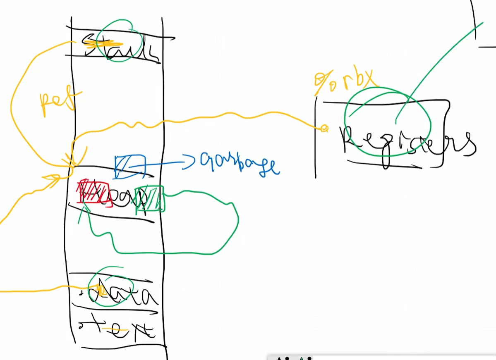

# csapp note

## 1.信息的表示和处理

### 00 无符号整数，二进制补码

- 1. 内存分块
  - $n/m \leq\ 2^m$
  - 共nbit内存，mbit一个块，需要满足上述关系才能找到块，就是m位寻址呗

- 2. 二进制与十进制 都是对同一个数的同构
  - 运算也是一一对应的  回想起近世代数知识
  - 符号序列的加一减一为循环运算，00-1 = 11   00 01 10 11 循环
  - 
  - 好吧还是没有显示 图片说明“补码的由来 妙啊”
  - 0  -4的并没有对称的啊 取反加一还是自己
  -   

### 01 位运算 树状数组  

- 1. **位运算找出二进制里最低位的1**  
  1010 & (~1010+1)(0110) = 0010  

  ```c
  unsigned LowBit(unsigned x){
    return x&(~x+1)
  }
  ```

  以此引出一个数据结构**树状数组**  

  

  线段树？？$T_i$  
  $S_i$为前n项和
  T数组和S数组的关系 向左最高的节点
  

  ```c
  int main(){
    unsigned n = 7;
    printf("S[u%] = \n", n)
    
    while(n>0){
      n = n - LowBit(n)
      prinft("T[u%]\n+", n)
    }
    printf("T[u%]\n", n)
  }
  ```

### 02 浮点数表示，类型转换  

$(-1)^s*1.f*2^E$  
the standard is set by IEEE

- 对于32位小数m来说  
- `s : m[31]`  
- `e : m[30-23]` 8位  `E = e-bias`  
- `f : m[22-0]` 23位 fraction
  - 比如e = -5，指数部分需减去一个`偏置bias = $2^(8-1)-1$= 127`


### 07 树与归约与栈
  
  reduce  归约  
  1+2+3+4 -> 10

### 08 代码重构啊啊啊  字符串汇编指令

  吐了  
  今天大概是要死这了  
  活过来了  

### 09 有限自动机计算立即数

  数字有好几种格式

- 0x13213
- -0x1231
- 1231
- -1231

通过状态机读取汇编代码的格式
  

- `0x`  bug 注意边界检查

### 0A 字符串解析汇编操作数

用两种解析方法解析表达式


- ca 遇到括号+1
- cb 遇到逗号+1


### 0B 解析完成 CPU标志位  

前缀树

状态机解析指令


### 0C 指令集部分完结

```c
  ac->reg.rax = 0x0;
  ac->reg.rbx = 0x0;
  ac->reg.rcx = 0x0;
  ac->reg.rdx = 0x0;
  ac->reg.rsi = 0x0;
  ac->reg.rdi = 0x0;
  ac->reg.rbp = 0x0;  
  ac->reg.rsp = 0x7ffffffee220;  //why don't wrok ?????????
```

完成 `TestAddFunctionCallAndComputation()`时发生的错误
为什么 rsp的值 为 比较小的数时, 第一条指令写不进去???
破解了!!!

```c
    "mov %rsp, %rbp",        //1
    "mov %rdi, -0x18(%rbp)",
```

秘密在这里,  初始化rsp为比较小的值的时候, 执行这两句语句时讲rsp原来的内容覆盖了. 我真是个天才

### 0D 第一阶段总结 数据类型, 计算类型

指令集

- URM unlimited register machine
- 四种指令 Z(ero) S(uccessor) T(ransfer) J(ump)
- 每个存储无限大, 有无限个贮存器
- 所有指令都是由这几种基本操作构成的

### 0E 第一阶段总结 递归函数 $\lambda$表达式

 `lambad` 表达式

 ```python
 x = lambda x : x*x #(python)

 ```

  数学上等价的
 说实话   没听懂

### 0F 链接ELF头部

- 标准程序std  0<=p<n
- 非标准程序  p>n

ELF

- Executable
- Linkable
- Format

一个文件f1定义  一个文件f2实现, 链接就是帮f1在f2中实现的函数在哪

文件

|<- offset n  
|
|
|
|
|
|<- offset 0


SHT SectionHearderTable 11(0xb) * 0x40  = 0x2c0大小

生成的链接文件

文件


两者一一对应  SHT offset为 02f8   size为 0040 entry个数为000c
所以SHT范围为[0x2f8, ox2f8+0c*40] 即 [02f8, 05f8]
6啊 算对了

首部是magic number


### 10 链接EOF节头表 Section hearder Table

- 指令`readelf -S elf.o`
  

```c
typedef struct
{
  Elf64_Word sh_name;  /* Section name (string tbl index) */
  Elf64_Word sh_type;  /* Section type */
  Elf64_Xword sh_flags;  /* Section flags */
  Elf64_Addr sh_addr;  /* Section virtual addr at execution */
  Elf64_Off sh_offset;  /* Section file offset */
  Elf64_Xword sh_size;  /* Section size in bytes */
  Elf64_Word sh_link;  /* Link to another section */
  Elf64_Word sh_info;  /* Additional section information */
  Elf64_Xword sh_addralign;  /* Section alignment */
  Elf64_Xword sh_entsize;  /* Entry size if section holds table */
} Elf64_Shdr;

```


### 11 链接-符号表 symbol table

- 指令`readelf -s elf.o`
  
  
scope  block

- .c文件
  - "a"
  - "func1()"
  - "func2()"
    - "T"
    - "i"
    - "while"
      - "j"
    - "k"
  - "main"

`i = j;`  
"j" ---Environment--> 0x7fffffabcd ---state(int)-->value  
如何找程序里的变量

维护 environment映射  
表 string->addr 比如哈希实现  

Function Internal : stack  
function external : text data  

这样一个程序就可以分两层

| s1.c     | s2.c     | s3.c     |
| -------- | -------- | -------- |
| external | ext      | ext      |
| internal | internal | internal |

链接做的就是  把各个文件的external链接起来


elf.c中的定义

```c
typedef struct
{
  Elf64_Word st_name;  /* Symbol name (string tbl index) */
  unsigned char st_info;  /* Symbol type and binding */
  unsigned char st_other;  /* Symbol visibility */
  Elf64_Section st_shndx;  /* Section index */
  Elf64_Addr st_value;  /* Symbol value */
  Elf64_Xword st_size;  /* Symbol size */
} Elf64_Sym;
```

`.symtab`  
`data1`  0x108+0x18*0x9 = 0x1e0
07 00 00 00             - st_name = data1
.strtab +0x07 = 0x247
64 61 74 61 31 00
d  a  t  a  1  \0

11                      - st_info  
00                      - st_other  
02 00                   - st_shndx  /* Section index */
0002 -- .data  
一般有

- .text
- .data
- .bss
- .comment
- .Rodata
- .COMMON

等等, 每个值都是动态的, 具体去Shr去看

00 00 00 00 00 00 00 00 - st_value  
08 00 00 00 00 00 00 00 - st_size  

```c
start :
Elf64_Shr[Elf64_Sym.st_shndx].sh_offset/*section_addr*/ + Elf64_Sym.st_value 

end : start + Elf64_sym.size-1  
ELF[start, end] -- symbol
```

  
0xdddd1111

`data2`  
0d 00 00 00
11
00  
02 00  
08 00 00 00 00 00 00 00  
08 00 00 00 00 00 00 00  

`func1`  

value = f3 0f 1e fa 55 48 89 e5  90 5d c3

13 00 00 00
12
00
01 00  -- .text  0x40  
00 00 00 00 00 00 00 00  +0

0b 00 00 00 00 00 00 00  

`func2`  
19 00 00 00
12  
00  
01 00  
0b 00 00 00 00 00 00 00
0b 00 00 00 00 00 00 00  

### 12 链接-符号Bind,Type,Index

  `st_info  unsigned char 8Byte`

- 高4位为 bind
- 低3位为 type

ST_BIND

```c  
#define STB_LOCAL 0  /* Local symbol */
#define STB_GLOBAL 1  /* Global symbol */
#define STB_WEAK 2  /* Weak symbol */
```

BIND 可见程度  
weak  碰到 global 就会被overwrite  

`local static`  
`global  nothing`  
`weak __attribute__((weak))`
定义与未定义
关键字

- extern
- static
- __attribute((weak))__

== 0 会进入 .bss段??

ST_TYPE

```c
#define STT_NOTYPE 0  /* Symbol type is unspecified */
#define STT_OBJECT 1  /* Symbol is a data object */
#define STT_FUNC 2  /* Symbol is a code object */
```

### 13 链接-读取ELF文本

### 14 链接-解析节头表符号表

```c
//.symtab  
//st_name,bind,type,st_shndex,st_value,st_size  
sum,STB_GLOBAL,STT_FUNC,.text,0,22
bias,STB_GLOBAL,STT_OBJECT,COMMON,8,8


```

### 15 链接-符号解析的三个原则

静态链接


```c
int a = 1;   //x.c
long long a = 2147483648;//y.c
```

发生这种冲突时, 链接器会选择小的保存

### 16 链接-section合并,计算运行时的地址

### 17 链接-引用重定位

### 18 链接完结-动态链接

### 19 链接总结

替换(lambda表达式类似)->编译

### 1A  内存问题简介:层次,一致性,虚拟内存

- cache  
- virsual memroy  
- interupt


cache misses

- compulsory miss /cold miss
- conflict miss
- capacity miss

### 1B 内存-cache地址格式

组相联
三元组


- ct cache tag    40
- ci cache index  6
- co cache offset 6


### 1C 内存-LRU缓存:写回,写分配,LRU替换策略

what's PR?


### 1D 内存-矩阵乘法优化,LRU正确性

//TODO : 更新LRU算法, cmu实验材料 比对  
这节得重现看
//TODO : python脚本的实现

矩阵乘法
matrix[32][32]  
每一行 计算就是 4*(1miss+7hit) + 4* 8miss = 36miss+28hit

```c
  for(i = 0;i<32;i++){
    for(j = 0;j<32;j++){
      for(k = 0;k<32;k++){
        C[i][j] = a[i][k]*[k][j];
      }
    }
  }

```

$\vec{C_k} = \sum_{i=0}^{31}a_{ik}*\vec{b_k}$
1/8miss

```c
  for(i = 0;i<32;i++){
    for(k = 0;k<32;k++){
      for(j = 0;j<32;j++){
        C[i][j] = a[i][k]*[k][j];
      }
    }
  }
```

### 1E 内存-MESI缓存一致性协议,并行计算的性能

MESI  

- exclusive Modified   --DIRTY
- Exclusive clean      --CLEAN
- Shared clean
  - shared write
  - 写回的处理器 S->M
  - 其他shared处理器 S->INVALID
- Invalid              --INVALID
  - 其他 INVALID
  - 其他 SHRAED/M  也就是访问后出现了shared的状态

|     | M   | E   | S   | I   |
| --- | --- | --- | --- | --- |
| M   | X   | X   | X   | O   |
| E   | X   | X   | X   | O   |
| S   | X   | X   | O   | O   |
| I   | O   | O   | O   | O   |

### 1F 内存-并行中的缓存伪共享

表面共享了 实际因为cache以块为单位, 实际两个进程仍然存在访问同一个cache行的情况

### 20 内存-多级页表,虚拟地址,物理地址


- 1. va2pa %  function
- 2. hashmap H(va) -> pa

pa = va + pa0 - va0(<=>$\triangle PV$)  
  
  分段 V0  P0 定义域 D   空间从(2k+1)->3M  
  问题->碎片 fragment
  -> 分页 (定长)
  维护表 (v0,p0)

  va2pa

- pa 不越界  %  H  S  P
- pa 不冲突     H  S  P
- 占用内存小       S  P
- locality        S  P
- 碎片少           S  P
- 映射快              P

page table 实现

2^36 个索引  太大了  
-> 多级页表

```c
/*
+-------+---------+-------+----------+-------------------+
| VPN3  |  VPN2   | VPN1  | VPN0     |                   |
+-------+---------+-------+-+--------+     VPO           |
|  TLBT                     | TLBI   |                   |
+-------------+-----------+----------+-------------------|
              |          PPN         |    PPO            |
              +----------------------+----------+--------+
              |       ct             |      ci  |  co    |    
              +----------------------+----------+--------+
*/
```

### 21 内存-页表格式项,多级页表的地址翻译

### 22 内存-实现多级页表


### 23 内存-pagefault处理,页表作为磁盘的缓存  

swap in  swap out

disk

### 24 内存-虚拟内存总览


PCB process control block  

p0 IDLE : 创建 p1 init  

云里雾里的哈哈

//TODO: watch again

//TODO: page fault -- interrupt


### 25 内存-实现反向映射与交换空间

page-map

```c
typedef struct{
  //TODO : if multiple processes are using this page? E.g. shared library
  pte4_t *pte4; //reversed mapping : ppn -> page_table_entry
  
  int allocated;
  int dirty;
  int time;  //LRU cache

  uint64_t daddr;  //binding the reverse mapping with mapping to disk 
}pd_t;

pd_t page_map[MAX_NUM_PHYSICAL_PAGE];  
```

### 26 内存-TLB硬件加速虚拟地址翻译

vpn->ppn  

- pagetable :DRAM <=> CPU
  - vpn : 4*9 vpn1 vpn2 vpn3 vpn4
- TLB: CPU <=> TLB
  - 36bits : TAG(32)+set_index(4)

### 27 内存-用户态heap malloc隐式空闲链表

heap模型


- 内部碎片
- 外部碎片

rbt 里面存在 padding  (限于 free)

### 28 内存-malloc的第一种实现

footer  --  header

### 29 内存-malloc空闲链表优化 Explicit list

这一节有点乱啊  改不过来了啊
implicit list
explicit list : free list  

### 2A 内存-malloc的第二种实现,双向环形explicit链表

explicit list

### 2B 内存-完成explicit链表, 平衡树malloc数据结构

segregated list  
binary search tree -> best fit

### 2C 内存-malloc的第三种实现:二叉搜索树插入与删除

面向对象的思想


### 2D 内存-BST删除


### 2E malloc-红黑树的定义与性质


- rbt  2-3-4tree
  - BT
  - key: BST : X.L < x < X.R
  - color : RBT
    - black height
    - BH = 0 ==> # || R(# #)
    - $T_h$ ==> B($T_{h-1}$ $T_{h-1}$)


### 2F malloc-红黑树,插入与旋转, 推导与实现

旋转:中序遍历的中间节点  


### 30 malloc-红黑树的删除

9种情况 实际是4种


```c
/******************************/
//red->0  black->1
// PSNF
// 0100 (4) 旋转，结束
// 0101 (5) 旋转，结束
// 0110 (6) 旋转，结束
// 0111 (7) 重新着色，结束
// 1011 (B) 旋转，转化为4,5,6,7
// 1100 (C) 旋转，结束
// 1101 (D) 旋转，结束
// 1110 (E) 旋转，结束
// 1111 (F) 重新着色，转化为4,5,6,7,B,C,D,E,F

//----------------------------//
```

### 31 malloc-红黑树删除实现

```c
void rbt_internal_delete(rbtree_internal_t *tree,
                         rbtree_node_interface *i_node,
                         uint64_t node_id)
```

### 32 malloc-malloc完结,小内存优化, 红黑树与链表结合

rbt内存堆内结构


红黑树最小的free块: 4+4*3+4(hdr par l r ftr) = 20 8bits对齐 -> 24  
极端利用率只有 1/24  

解决-> 利用8bits对齐的最后一位

- 8bits smalllist
- 16bits explicit_list
- \>=24bits rbt cv


### 33 垃圾回收-引用计数

回顾alloc

压缩? compacting  就把所有的free合在一起

搜索策略


发现内存为垃圾  
比如定期扫描看哪一块内存没有被引用



引用计数

### 34 垃圾回收-标记清扫、标记压缩算法

四种垃圾回收算法

- reference count(csapp)
  - python 
  - 
- mark-sweep
  - tracing
  - 标记所有的已分配内存, 然后遍历heap释放mark = 0的已分配节点  
- mark-compact
  - tracing
- mark-copy(sicp:lisp)
  - tracing
- generational 分代

用 dfs(内存中的stack)实现mark

```c
//全局变量
typedef struct{
  int i;
  int j;
}a;

// 只有a 分配在 .date段
// i和j 被分配在.heap中

//函数里面声明的变量 分配在 .stack中
```

mark sweep


dfs
三轮扫描
- updateReference : fast slow
  - forward address: stored in hdr  
- updateForward  
  - parent updates  
- copy 

### 垃圾回收-标记复制、引用计数算法

mark-copy

两段heap  From  To
2 semi-space


每次要重新定位forward


count
引用计数  --- 连锁问题 -- dfs

问题 环形引用 无法回收
- 1. strong  weak
- 2. mark_sweep 
- 3. trail deletion(非常复杂)

### 36 垃圾回收-分代垃圾回收GC

generational GC

存在那种一直有被引用的内存, 但每次mark的时候仍然扫描, 浪费了时间

分层(分代) generational  每层满了再去mark


引出三个问题
- 跨gen引用
  - roots
  -   
  这种情况不访问gen1 就把(9)当成垃圾了
  - 要记录 gen1 --> gen0的引用表(即使存在gen1中已经成为垃圾却仍有引用的情况)
  - 处理g1时才能发现上述情况垃圾
- large object
  - 大文件要不要copy?
    - 设置一个专门的空间用于存储大文件
    - 
- native object 
  - c/cpp  不知道对象的具体类型
  - 听不懂  TODO再来一遍

### 37 异常控制流-同步的Fault、系统调用, 异步的中断

ECF
- os proc manage 
- isa
- device

异常控制表?  系统启动时读取到dram中(read only)


exception table


- return to I_curr
- return to I_next
- aborts the interrupted program

exception
- sync
  - Trap/syscall  -- int syscall iret
  - Fault -- page fault, divided by zero
  - Abort   -- null , segment fault , code dunp
- Async
  - Interrupt  I/O:key board, mouse, disk, network

### 38 异常控制流-系统调用


